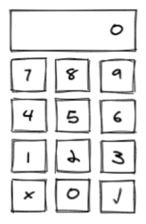

# NUMPAD

You have been tasked with implementing a number pad. A user can enter a quantity via a series of static numerical buttons.

## Use Cases

The number pad should be able to support the following use cases:

* Numeric buttons that when tapped in order: 1, 2, 3 present the number 123 in the top display
* A clear button (✗ button above - svg provided in `/src/assets`)
* An acceptance key (✓ button above - svg provided in `/src/assets`)
  * Can just alert the current value for the purpose of this exercise
* An initial value
  * If no initial value is specified, it should equal 0
